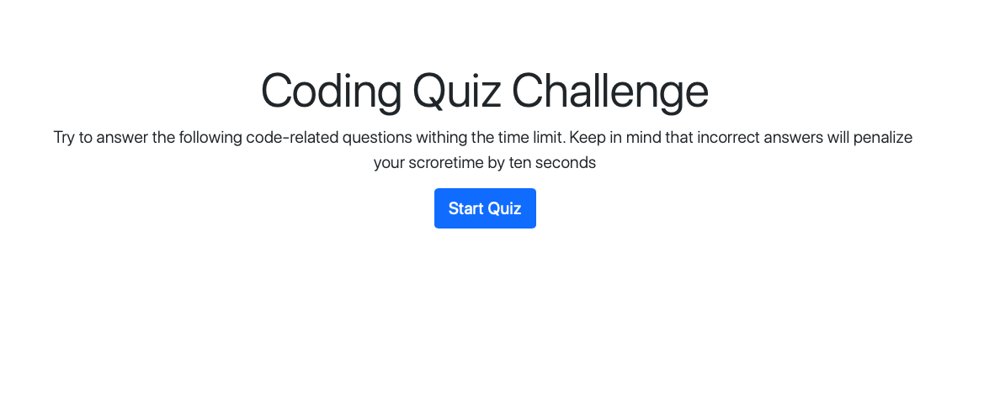
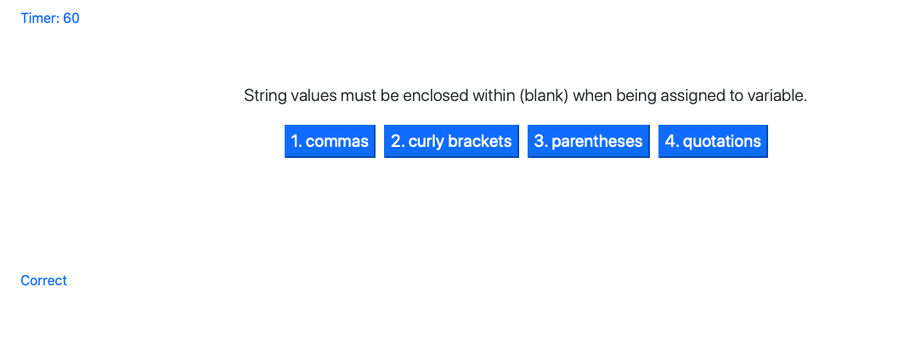

# JavaScript Quiz

This is quiz about JavaScript. Come ready to answer questions withing the limite and get your name printed as a highscore.


**Criteria provider by the client:**

```
GIVEN I am taking a code quiz
WHEN I click the start button
THEN a timer starts and I am presented with a question
WHEN I answer a question
THEN I am presented with another question
WHEN I answer a question incorrectly
THEN time is subtracted from the clock
WHEN all questions are answered or the timer reaches 0
THEN the game is over
WHEN the game is over
THEN I can save my initials and score
```

# How it Works?:

* To start the quiz click on the "Start Quiz" button
* The first question of the quiz will pop-up with multiple answers. As you choose an answer it will look if the answer is correct or wrong and it will display it on the page. If you choose an incorrect answer the time will be reduced to 10 seconds. If the answer is correct you will gain 10 seconds and 10 points.
* If you finish the game or you run out of time, it will display to a page with your score, time and an field for you to enter your name.
* If you do a great job, you could be on the "High Score" list.
* Have fun and good luck!


# Mockup:





# Resources:

* Visual Code - used to modify html and css files
* Google developer tools - to test changes
* Chrome, Safari, Firefox - to ensure page render correctly
* Mozilla JavaScript
* Boostrap

# Repository:

* Repository: https://github.com/CivicaJR91/Javascript-Quiz-Application
* Page Link: https://civicajr91.github.io/Javascript-Quiz-Application/

# Note: 
This is not completed. As of 10.24.20

